# devops-netology

# Домашнее задание к занятию «Системы контроля версий»
Выполнил: Береснев Игорь Андреевич

---

Создание репозитория и первого коммита

Зарегистрируйте аккаунт на https://github.com/. Если предпочитаете другое хранилище для репозитория, можно использовать его.

Создайте публичный репозиторий, который будете использовать дальше на протяжении всего курса, желательное с названием devops-netology. Обязательно поставьте галочку Initialize this repository with a README.

Создайте авторизационный токен для клонирования репозитория.

Склонируйте репозиторий, используя протокол HTTPS (git clone ...).

### Скриншот клонирования репозитория

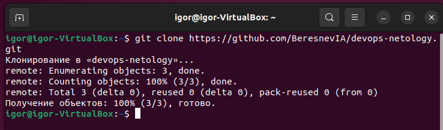

Перейдите в каталог с клоном репозитория (cd devops-netology).

Произведите первоначальную настройку Git, указав своё настоящее имя, чтобы нам было проще общаться, и email (git config --global user.name и git config --global user.email johndoe@example.com).

Выполните команду git status и запомните результат.

### Скриншот настройки Git и команды git status

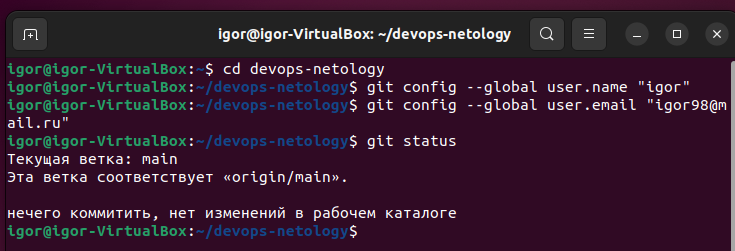

Отредактируйте файл README.md любым удобным способом, тем самым переведя файл в состояние Modified.

### Скриншот нового коммита

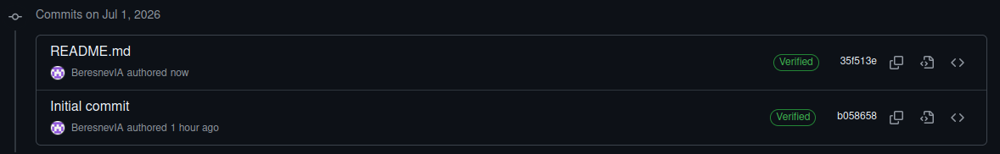
Это строка для проверки git diff

Ещё раз выполните git status и продолжайте проверять вывод этой команды после каждого следующего шага.

### Скриншот команды git status

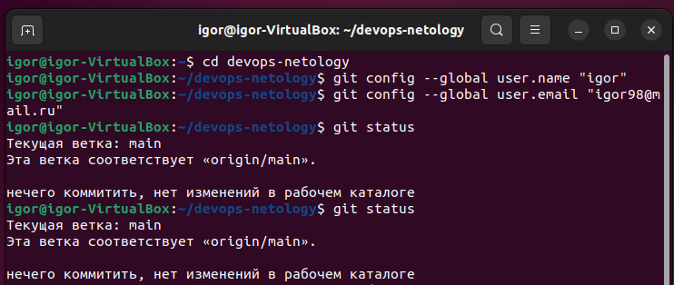

Теперь посмотрите изменения в файле README.md, выполнив команды git diff и git diff --staged.

### Скриншот команд git diff и git diff --staged

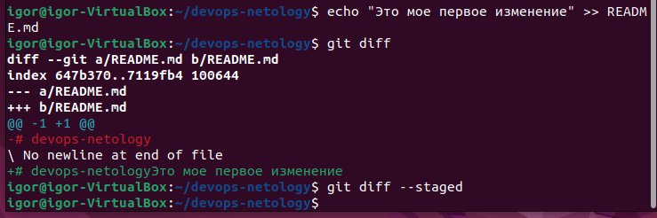

И ещё раз выполните команды git diff и git diff --staged. Поиграйте с изменениями и этими командами, чтобы чётко понять, что и когда они отображают.

### Скриншот команд git diff и git diff --staged

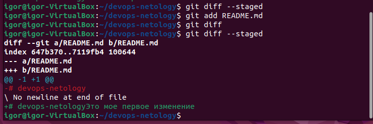

### Скриншот команды git status

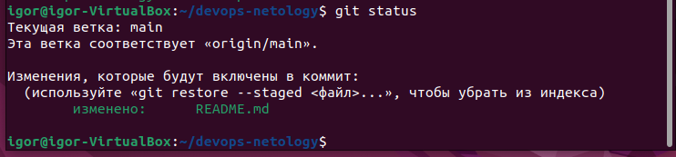

Теперь можно сделать коммит git commit -m 'First commit'.

### Скриншот сделанного коммита

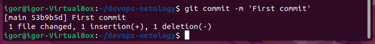

И ещё раз посмотреть выводы команд git status, git diff и git diff --staged.

### Скриншот команд git status, git diff и git diff --staged.

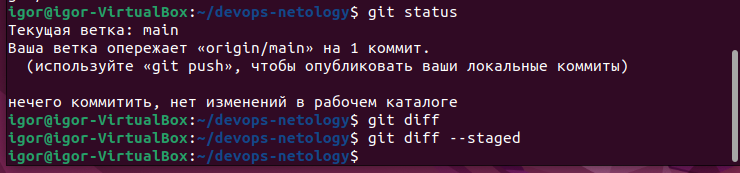

Создайте файл .gitignore (обратите внимание на точку в начале файла), проверьте его статус сразу после создания.

### Скриншот создания файла .gitignore и проверка статуса

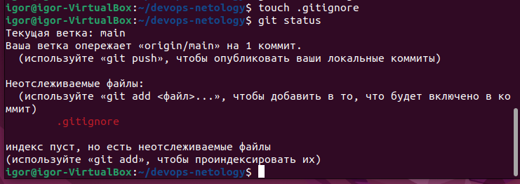

Добавьте файл .gitignore в следующий коммит (git add...).

На одном из следующих блоков вы будете изучать Terraform, давайте сразу создадим соотвествующий каталог terraform и внутри этого каталога — файл .gitignore по примеру: https://github.com/github/gitignore/blob/master/Terraform.gitignore.

### Скриншот добавления файла .gitignore

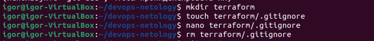

В файле README.md опишите своими словами, какие файлы будут проигнорированы в будущем благодаря добавленному .gitignore.

### Скриншот файла README.md

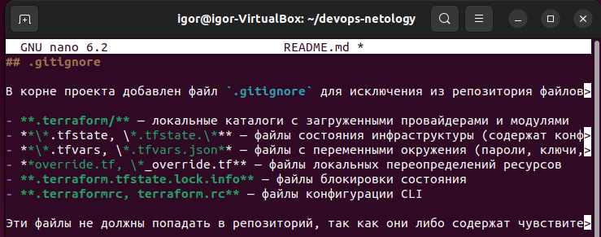

## .gitignore

В корне проекта добавлен файл `.gitignore` для исключения из репозитория файлов, связанных с Terraform:

- **.terraform/** — локальные каталоги с загруженными провайдерами и модулями
- **\*.tfstate, \*.tfstate.\*** — файлы состояния инфраструктуры (содержат конфиденциальные данные)
- **\*.tfvars, \*.tfvars.json** — файлы с переменными окружения (пароли, ключи, токены)
- **override.tf, \*_override.tf** — файлы локальных переопределений ресурсов
- **.terraform.tfstate.lock.info** — файлы блокировки состояния
- **.terraformrc, terraform.rc** — файлы конфигурации CLI

Эти файлы не должны попадать в репозиторий, так как они либо содержат чувствительные данные, либо являются временными/локальными.

Закоммитьте все новые и изменённые файлы. Комментарий к коммиту должен быть Added gitignore.

### Скриншот добавления коммита

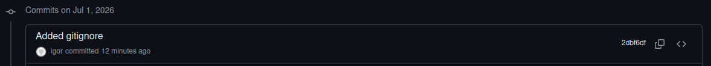

Создайте файлы will_be_deleted.txt (с текстом will_be_deleted) и will_be_moved.txt (с текстом will_be_moved) и закоммите их с комментарием Prepare to delete and move.

В случае необходимости обратитесь к официальной документации — здесь подробно описано, как выполнить следующие шаги.
Удалите файл will_be_deleted.txt с диска и из репозитория.

### Скриншот создания файлов

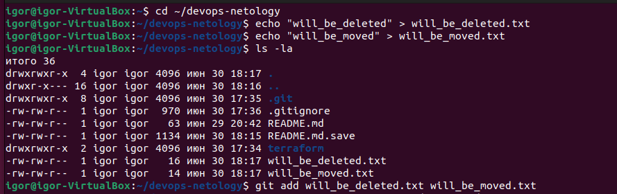

### Скриншот добавления коммита

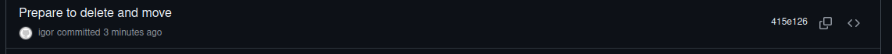

Удалите файл will_be_deleted.txt с диска и из репозитория.

Переименуйте (переместите) файл will_be_moved.txt на диске и в репозитории, чтобы он стал называться has_been_moved.txt.

### Скриншот удаления и перееминования

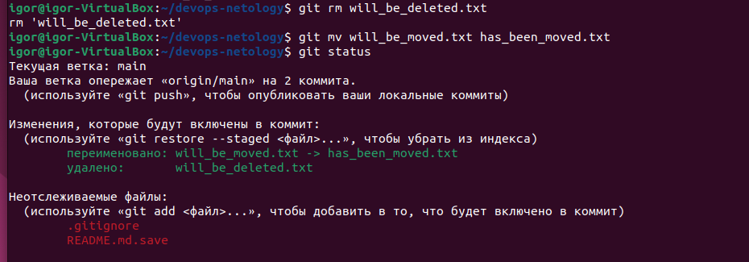

### Скриншот добавления коммита

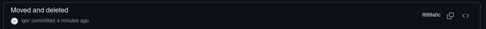
